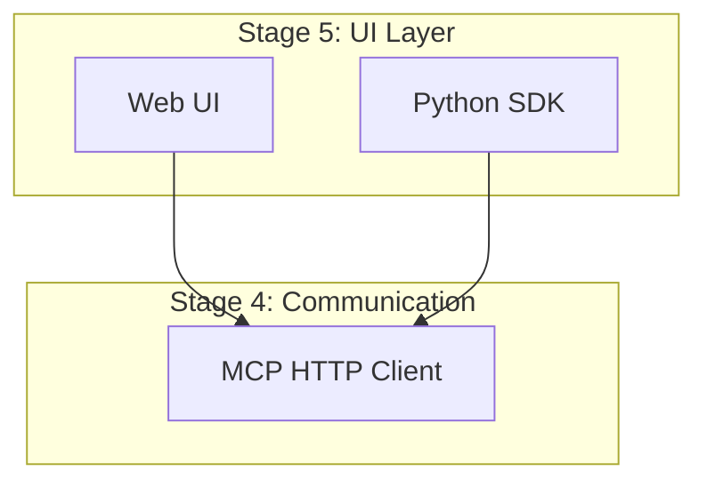

# building-block-reviewer.md
- agent_id: "building-block-reviewer"
- role: "Reviews architecture for building-block principles and outputs prioritized improvements"
- phase_applicability: ["ReleaseGate"]
- primary_outputs:
  - "docs/BUILDING_BLOCKS_REVIEW.md"
- gates_enforced:
  - "final_checklist_pass"

## Agent
- agent_id: building-block-reviewer
- role: Validate module boundaries, testability, and separation of concerns.

## Inputs
- task:
- phase:
- scope:
- constraints:

## Work performed
- Review for SRP, separation of concerns, validation, testability, reusability
- Document prioritized recommendations

**CRITICAL - Documentation Standards:**
- All architecture diagrams MUST use Mermaid flowchart syntax
- NO ASCII box diagrams allowed
- NO text-based diagrams allowed
- Use `flowchart TB` or `flowchart LR` for all visual representations

**Example - Correct:**


**Example - INCORRECT (DO NOT USE):**
```
┌─────────────────────────────────┐
│  Stage 5: UI Layer              │
│  ├─ Web UI                      │
│  └─ SDK                         │
└─────────────────────────────────┘
```

## Changes
- Provide diffs.

## Updated artifacts
- created:
- modified:
- unchanged:

## Gates
- final_checklist_pass: pass/fail
  - evidence:
  - remediation:

## Notes
- assumptions:
- limitations:
- follow-ups:
