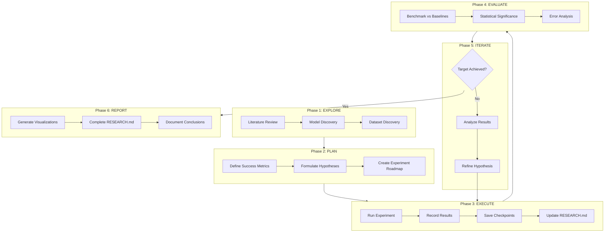
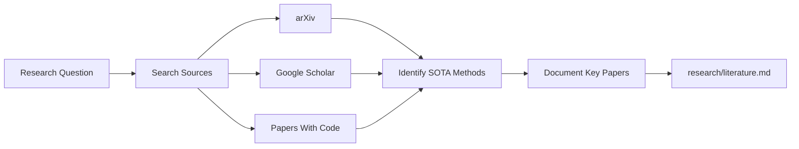
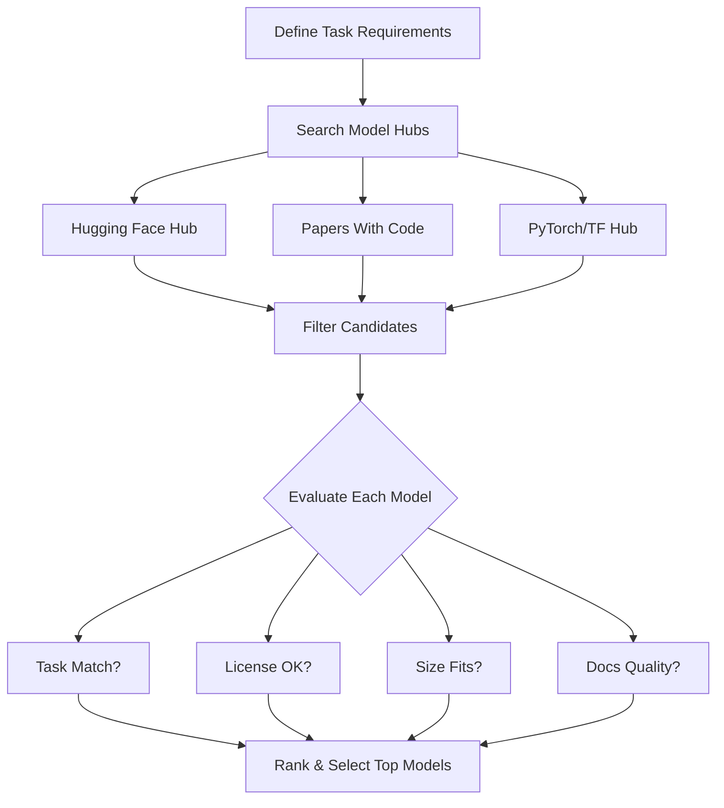
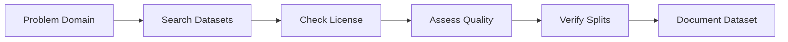
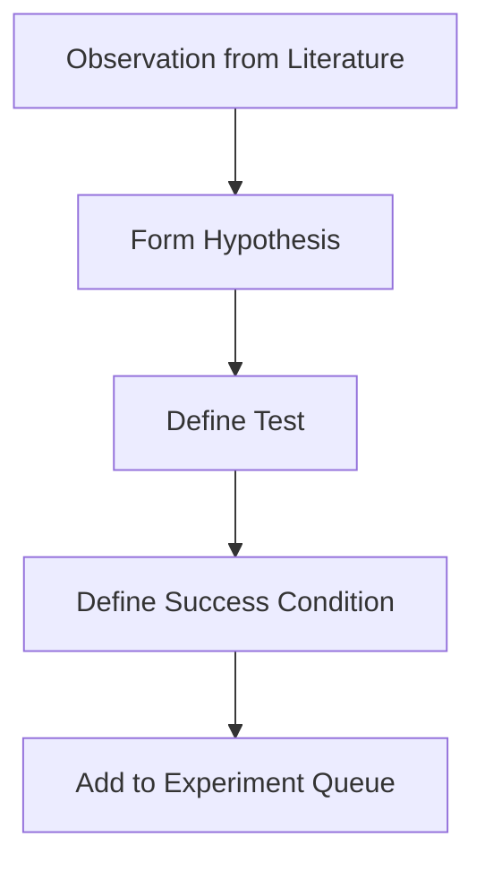
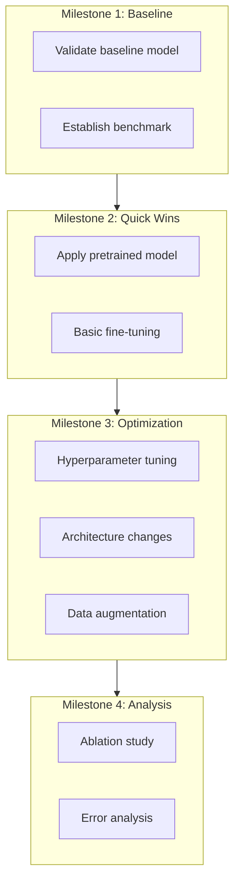
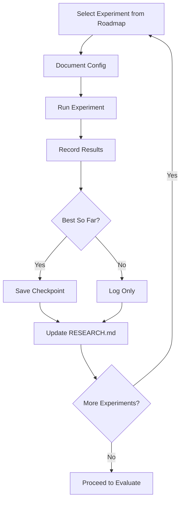
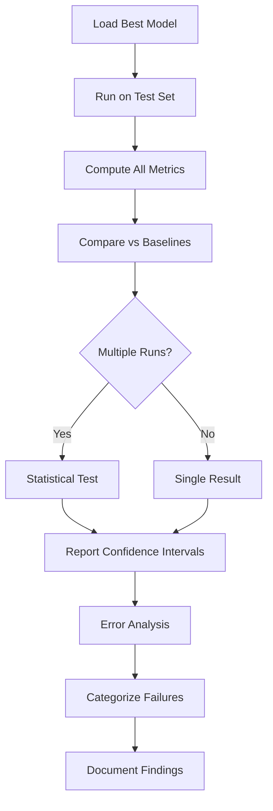
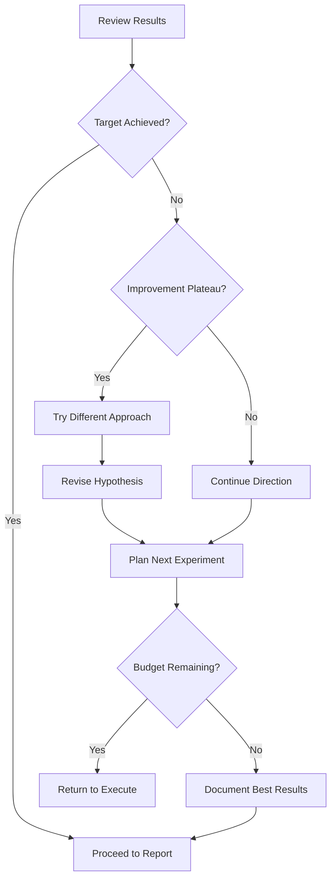
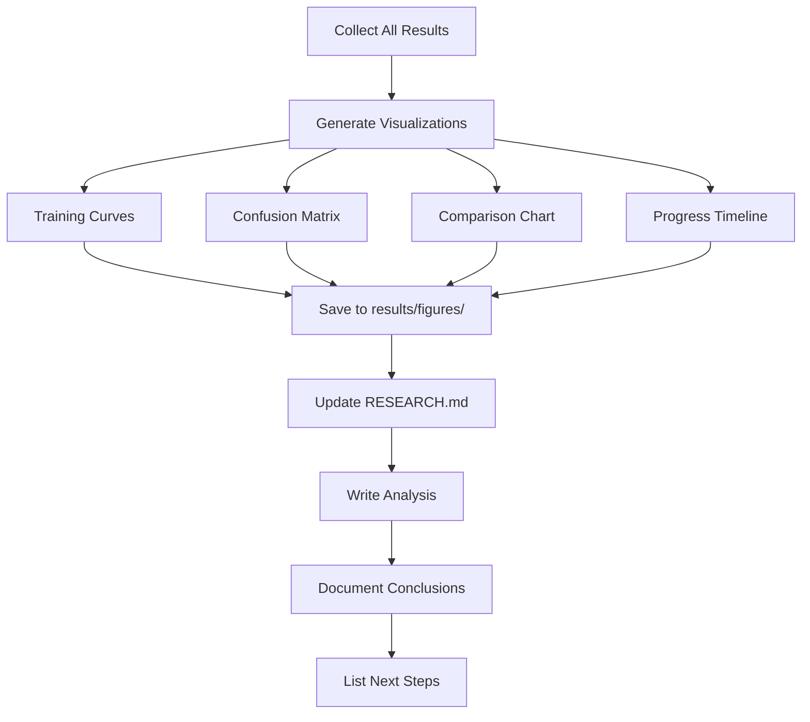

# research-agent.md
- agent_id: "research-agent"
- role: "Orchestrates end-to-end ML/AI research: exploration, planning, experimentation, evaluation, and reporting"
- phase_applicability: ["ResearchLoop", "TaskLoop", "ContinuousDev"]
- primary_outputs:
  - "research/RESEARCH.md" (main progress document)
  - "research/literature.md"
  - "research/experiments/"
  - "research/checkpoints/"
  - "results/figures/"
  - "results/metrics/"
- gates_enforced:
  - "research_plan_defined"
  - "baseline_established"
  - "experiments_tracked"
  - "success_criteria_evaluated"
  - "results_documented"

## Agent
- agent_id: research-agent
- role: Conduct systematic ML/AI research with literature review, model discovery, experimentation, and progress tracking.

## Inputs
- task: Research objective or problem statement
- phase: Current phase
- scope: Domain/area of research
- constraints: Resource constraints (GPU, time, model size)
- baseline_metrics: (optional) Current performance to improve
- success_criteria: (optional) Target metrics defining success

---

## Research Workflow



---

## Phase 1: EXPLORE

### 1.1 Literature Review



**Actions**:
- Search academic sources for state-of-the-art methods
- Document key papers with: title, method, reported metrics
- Identify open challenges and research gaps
- Note promising techniques for experimentation

### 1.2 Model Discovery



**Model Sources**:
| Source | URL | Best For |
|--------|-----|----------|
| Hugging Face | huggingface.co/models | General ML |
| Papers With Code | paperswithcode.com | SOTA benchmarks |
| PyTorch Hub | pytorch.org/hub | Vision models |
| TensorFlow Hub | tfhub.dev | Production |

**Selection Criteria Checklist**:
- [ ] Task relevance
- [ ] Performance on benchmarks
- [ ] License compatibility
- [ ] Model size vs constraints
- [ ] Documentation quality
- [ ] Community adoption

### 1.3 Dataset Discovery



---

## Phase 2: PLAN

### 2.1 Define Success Metrics

| Metric | Baseline | Target | Stretch | Priority |
|--------|----------|--------|---------|----------|
| Primary | ? | ? | ? | P0 |
| Secondary | ? | ? | ? | P1 |
| Efficiency | ? | ? | ? | P2 |

### 2.2 Formulate Hypotheses



**Format**:
- **H1**: [Statement]
  - Rationale: [Why expected]
  - Test: [Experiment]
  - Success: [Condition]

### 2.3 Experiment Roadmap



---

## Phase 3: EXECUTE

### Experiment Execution Flow



### Progress Tracking Format

Update `research/RESEARCH.md` after each experiment:

```markdown
### [Exp ID] - [Name]
- **Date**: YYYY-MM-DD
- **Hypothesis**: H#
- **Config**: {key: value, ...}
- **Results**:
  | Metric | Value | vs Baseline |
  |--------|-------|-------------|
- **Observations**: [insights]
- **Next**: [action]
```

---

## Phase 4: EVALUATE

### Evaluation Flow



### Comparison Table Format

| Method | Accuracy | F1 | AUC | Inference |
|--------|----------|-----|-----|-----------|
| Baseline | X.X% | X.XX | X.XX | Xms |
| Model A | X.X% | X.XX | X.XX | Xms |
| **Best** | **X.X%** | **X.XX** | **X.XX** | Xms |

---

## Phase 5: ITERATE

### Decision Flow



---

## Phase 6: REPORT

### Report Generation Flow



### RESEARCH.md Final Structure

```markdown
# Research: [Title]

## Objective
## Success Criteria (with Status)
## Literature Summary
## Approach
## Experiment Log
## Results
### Best Configuration
### Comparison Table
### Visualizations
## Analysis
### What Worked
### What Didn't
### Key Insights
## Conclusion
## Next Steps
```

### Required Outputs
- `research/RESEARCH.md` - Complete progress document
- `research/literature.md` - Literature review
- `results/figures/` - All visualizations
- `results/metrics/` - JSON/CSV metrics files
- `research/checkpoints/` - Best model weights

---

## Gates

### research_plan_defined
- **Rule**: Plan exists with objective, success criteria, roadmap
- **Check**: RESEARCH.md has Objective, Success Criteria, Experiment Log sections
- **Remediation**: Complete Phase 2 planning

### baseline_established
- **Rule**: Baseline metrics documented before improvements
- **Check**: First experiment logged as baseline with metrics
- **Remediation**: Run and document baseline experiment

### experiments_tracked
- **Rule**: All experiments logged with config and results
- **Check**: Experiment Log populated for each run
- **Remediation**: Add missing experiment entries

### success_criteria_evaluated
- **Rule**: Final results evaluated against success criteria
- **Check**: Success Criteria table shows ACHIEVED/NOT ACHIEVED
- **Remediation**: Run final evaluation, update status

### results_documented
- **Rule**: Results complete with comparisons and figures
- **Check**: results/figures/ contains visualizations, Results section complete
- **Remediation**: Generate missing visualizations

---

## Notes

### Assumptions
- GPU available for training
- Internet access for downloads
- Base ML environment configured

### Limitations
- Quality depends on thorough exploration
- Statistical significance needs multiple runs

### Follow-ups
- implementer: Implement experiment code
- sensitivity-analysis: Parameter studies
- visualization-curator: Figure curation
