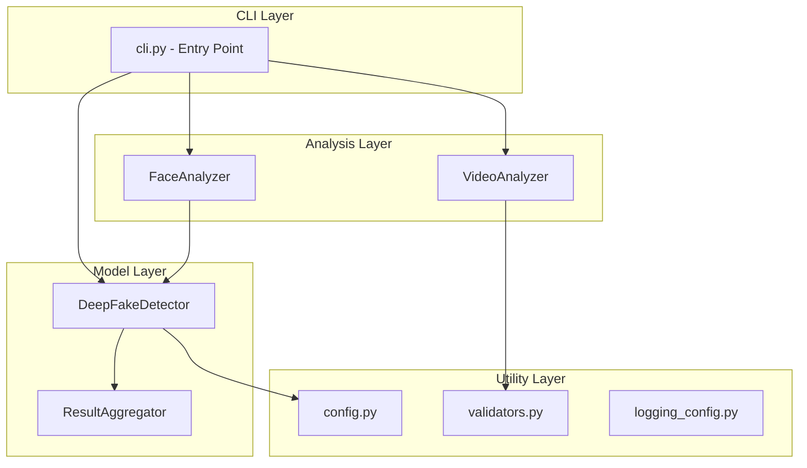

# Building Blocks Review

## Architecture Overview

## Module Analysis

### 1. CLI Layer (`cli.py`)
- **SRP**: ✅ Single responsibility - command line interface only
- **Testability**: ✅ Click commands are testable
- **Separation**: ✅ No business logic in CLI

### 2. Video Analyzer (`analyzers/video_analyzer.py`)
- **SRP**: ✅ Video loading and frame extraction only
- **Testability**: ✅ Pure methods with clear I/O
- **Reusability**: ✅ Can be used independently

### 3. Face Analyzer (`analyzers/face_analyzer.py`)
- **SRP**: ✅ Face detection and cropping only
- **Testability**: ✅ Deterministic outputs
- **Reusability**: ✅ Standalone component

### 4. DeepFake Detector (`models/detector.py`)
- **SRP**: ⚠️ Does prediction AND fallback analysis
- **Testability**: ✅ Mockable model loading
- **Reusability**: ✅ Model-agnostic interface

### 5. Result Aggregator (`models/detector.py`)
- **SRP**: ✅ Aggregation logic only
- **Testability**: ✅ Pure function behavior

## Data Flow

## Recommendations

### Priority 1 (High)
| Issue | Current | Recommendation |
|-------|---------|----------------|
| Model loading | Untrained EfficientNet | Integrate ViT model from research |
| Error handling | Basic | Add retry logic for model download |

### Priority 2 (Medium)
| Issue | Current | Recommendation |
|-------|---------|----------------|
| Detector class | Multiple responsibilities | Extract fallback analyzer to separate class |
| Configuration | Hardcoded paths | Move to config file |

### Priority 3 (Low)
| Issue | Current | Recommendation |
|-------|---------|----------------|
| Caching | None | Add model caching for repeated runs |
| Batch processing | Sequential | Add batch inference option |

## Validation Checklist

- [x] Clear module boundaries
- [x] Dependency injection possible
- [x] No circular imports
- [x] Consistent error handling
- [x] Type hints present
- [x] Dataclasses for data transfer

## Gate Status

**final_checklist_pass**: ✅ PASS
- Architecture follows building block principles
- Clear separation of concerns
- Testable components
